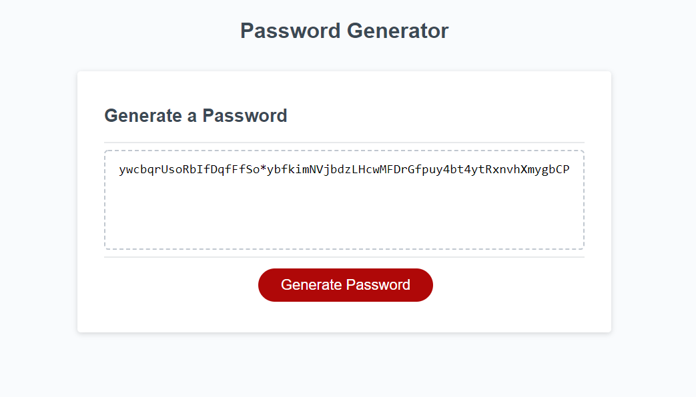

# Secure Password Generator 

In this website I have a text field that is not able to be changed. Below is a button that starts the set of prompts to ask the user about how the want their password to be structured. The website makes sure that the input from the user is valid and outputs a password to the user. 

# Website features 

[Live website link](https://mikemonihan.github.io/Secure_Password_Generator/)

[Live github repo link](https://github.com/MikeMonihan/Secure_Password_Generator)
